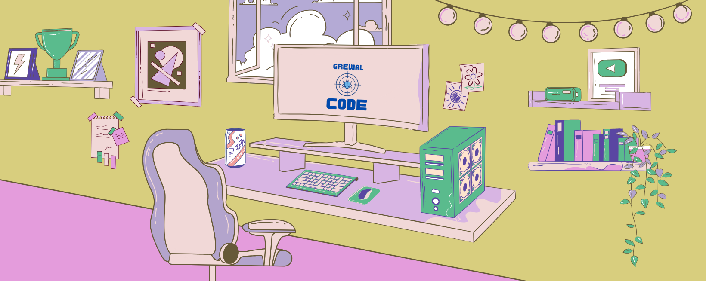

<h1 align="center">Hi 👋, I'm Pravesh Grewal</h1>
<h3 align="center">A Data Scientist from India</h3>

 

 
  
<!--   -->
<!--   -->

  <!--  -->
  
  <!-- 
  
   -->
 

 

  
  
  
  <!--  -->
  <!-- 
   -->

  

- 🔭 I’m currently working on **my life**

- 🌱 I’m currently learning **Machine Learning**

- 💬 Ask me about **, Python and Data-Science**

- 📫 How to reach me **Grewalpravesh@outlook.com**

- ⚡ Fun fact **I think I'm Serious about life**

 
<h3 align="left">Connect with me:</h3>

 

<h3 align="left">Languages and Tools:</h3>

  

  

- Database

  

- Cloud Servers

  

- Tools

  

 

<h3 align="left">Trophy:</h3>

  

<!--  -->
 

 

   

<h3 align="left">GitHub Stats:</h3>

 

  

<h3 align="left">Activity:</h3>

  

