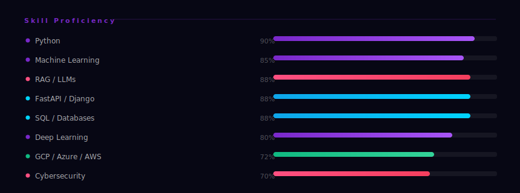
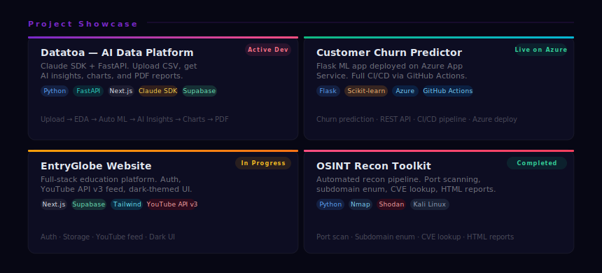

<!-- ============================================================
     PRAVESH GREWAL — GitHub Profile README v6.0
     Uses custom animated SVG files for real wow-factor effects
     ============================================================ -->

<!-- ANIMATED HEADER SVG (commit header.svg to your repo root) -->
<div align="center">

</div>

<br/>

<!-- SOCIAL LINKS -->
<div align="center">

[](https://linkedin.com/in/pravesh-grewal)
[](https://www.youtube.com/@entryglobe)
[](https://github.com/praveshgrewal)
[](https://medium.com/@studyjiger)
[](https://www.instagram.com/codegrewal)
[](mailto:Grewalpravesh@outlook.com)

<br/>


</div>

---

## About Me

<table>
<tr>
<td width="52%" valign="top">

```yaml
╔══════════════════════════════════════════╗
║         PRAVESH GREWAL — v6.0            ║
╠══════════════════════════════════════════╣
║  name      : Pravesh Grewal              ║
║  location  : Noida, India                ║
║  email     : Grewalpravesh@outlook.com   ║
╠══════════════════════════════════════════╣
║  currently:                              ║
║    - Data Science Trainer                ║
║      @ Croma Campus & SkillCircle        ║
║    - Building Datatoa (AI platform)      ║
║    - Running EntryGlobe on YouTube       ║
╠══════════════════════════════════════════╣
║  expertise:                              ║
║    LLMs · RAG · LoRA Fine-tuning         ║
║    Ethical Hacking · OSINT               ║
║    FastAPI · Next.js · Django            ║
║    GCP · Azure · AWS                     ║
╠══════════════════════════════════════════╣
║  open_to:                                ║
║    AI/ML Collabs · Freelance Training    ║
║    EdTech Partnerships · Speaking        ║
╠══════════════════════════════════════════╣
║  motto: "Learn it. Build it.             ║
║          Break it. Repeat."              ║
╚══════════════════════════════════════════╝
```

</td>
<td width="48%" align="center" valign="middle">


<br/>

[](https://linkedin.com/in/pravesh-grewal)
[](https://www.youtube.com/@entryglobe)

</td>
</tr>
</table>

---

## Tech Stack

<div align="center">

**Languages & Core**

[](https://github.com/praveshgrewal)

**Frameworks & Libraries**

[](https://github.com/praveshgrewal)

**AI / ML**

[](https://github.com/praveshgrewal)
&nbsp;


**Cloud & DevOps**

[](https://github.com/praveshgrewal)

**Databases**

[](https://github.com/praveshgrewal)

</div>

---

## Skill Proficiency

<!-- ANIMATED SKILL BARS SVG (commit skills.svg to your repo root) -->


---

## Currently Building

<div align="center">
<table>
<tr>
<td align="center" width="50%">


### Datatoa — AI Data Platform

> *"Like ChatGPT, but for your data."*

Upload any CSV. Datatoa auto-analyzes it — generating instant charts, AI insights, and downloadable PDF reports. Powered by the Claude SDK, FastAPI, and scikit-learn.


```
Upload → EDA → Auto ML → AI Insights → Charts → PDF
```

</td>
<td align="center" width="50%">


### EntryGlobe — YouTube Channel

> *"Start Here. Go Global."*

Teaching Python, SQL, Machine Learning, Power BI, and Advanced Excel to aspiring data professionals — structured, beginner-friendly, and built to get you job-ready.


[](https://www.youtube.com/@entryglobe)

</td>
</tr>
</table>
</div>

---

## Project Showcase

<!-- ANIMATED PROJECT CARDS SVG (commit projects.svg to your repo root) -->


---

## Full Stack Profile — In Code

```python
# ┌────────────────────────────────────────────────────────────────────┐
# │           PRAVESH GREWAL  —  AI × Security × Web × Education       │
# └────────────────────────────────────────────────────────────────────┘

class PraveshGrewal:

    name        = "Pravesh Grewal"
    location    = "Noida, India"
    contact     = "Grewalpravesh@outlook.com"
    channel     = "youtube.com/@entryglobe  |  Start Here. Go Global."

    # ── Training & Education ──────────────────────────────────────────
    trainer_at  = ["Croma Campus", "SkillCircle", "Freelance"]
    teaches     = ["Data Science", "SQL", "Python", "ML Deployment",
                   "GCP", "Azure ML", "Web Development", "Cybersecurity"]

    # ── AI / ML / GenAI ───────────────────────────────────────────────
    llms        = ["GPT-4o", "Claude 3.5 Sonnet", "Gemini 1.5 Pro",
                   "Mistral", "LLaMA 3"]
    rag         = ["LangChain", "LlamaIndex", "FAISS",
                   "Pinecone", "ChromaDB", "Weaviate"]
    dl_arch     = ["CNN", "RNN", "LSTM", "GAN", "VAE",
                   "Transformers", "BERT", "ViT", "CLIP"]
    finetune    = ["LoRA", "QLoRA", "PEFT", "DPO",
                   "Instruction Tuning", "RLHF"]

    # ── Active Projects ───────────────────────────────────────────────
    projects    = {
        "Datatoa"        : "AI-powered one-click data analysis platform",
        "EntryGlobe"     : "Data Science education on YouTube",
        "EntryGlobe Web" : "Full-stack platform — Next.js + Supabase",
        "mlflask"        : "Flask churn prediction app on Azure"
    }

    motto = "Learn it. Build it. Break it. Repeat."
```

---

## GitHub Trophies

<div align="center">

</div>

---

## GitHub Stats

<div align="center">


&nbsp;


</div>

<div align="center">

</div>

<div align="center">

</div>

---

## WakaTime Coding Activity

<!--START_SECTION:waka-->
```text
Python       ██████████████████░░░   18 hrs 24 mins   72%
JavaScript   ████░░░░░░░░░░░░░░░░░    3 hrs 12 mins   13%
HTML/CSS     ██░░░░░░░░░░░░░░░░░░░    2 hrs 05 mins    8%
SQL          █░░░░░░░░░░░░░░░░░░░░    1 hr  18 mins    5%
Other        █░░░░░░░░░░░░░░░░░░░░    0 hrs 38 mins    2%
```
<!--END_SECTION:waka-->

---

## EntryGlobe — Latest Videos

<div align="center">

[](https://www.youtube.com/@entryglobe)

<!-- BEGIN YOUTUBE-CARDS -->
<!-- END YOUTUBE-CARDS -->

</div>

---

## Contribution Snake

<div align="center">
<picture>
  <source media="(prefers-color-scheme: dark)"  srcset="https://raw.githubusercontent.com/praveshgrewal/praveshgrewal/output/github-contribution-grid-snake-dark.svg"/>
  <source media="(prefers-color-scheme: light)" srcset="https://raw.githubusercontent.com/praveshgrewal/praveshgrewal/output/github-contribution-grid-snake.svg"/>
  
</picture>
</div>

---

<div align="center">

> *"Learn it. Build it. Break it. Repeat."*
> — **Pravesh Grewal** &nbsp;|&nbsp; [EntryGlobe](https://www.youtube.com/@entryglobe) — *Start Here. Go Global.*

> **Open to:** AI/ML collabs &nbsp;·&nbsp; Freelance training &nbsp;·&nbsp; EdTech partnerships &nbsp;·&nbsp; Speaking

</div>

---


